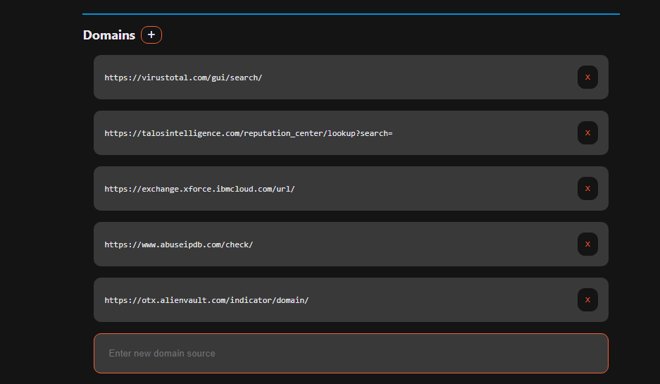
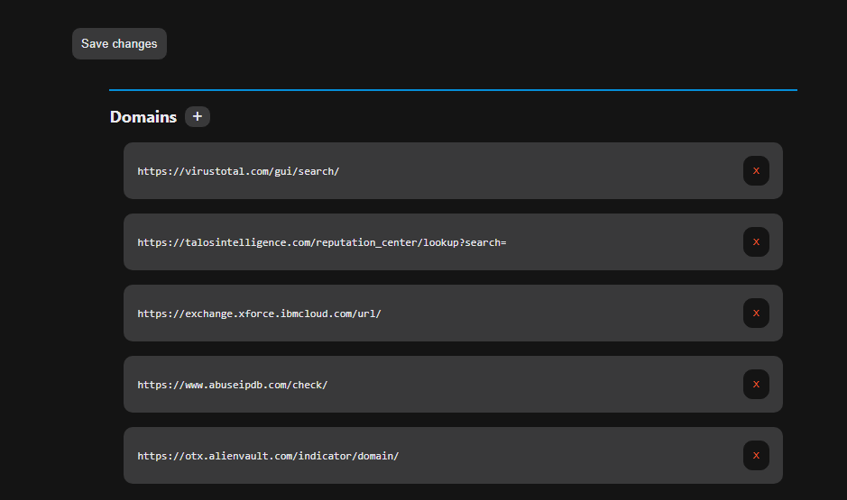
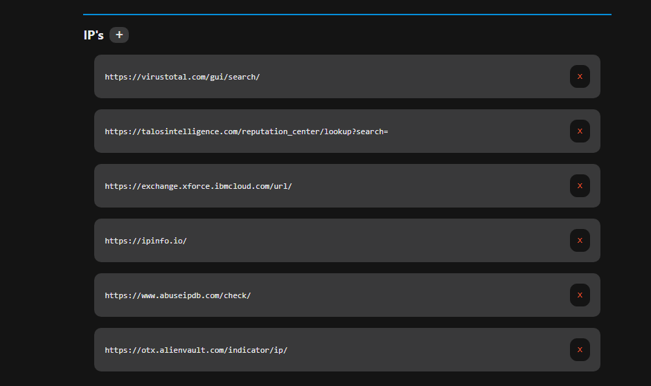
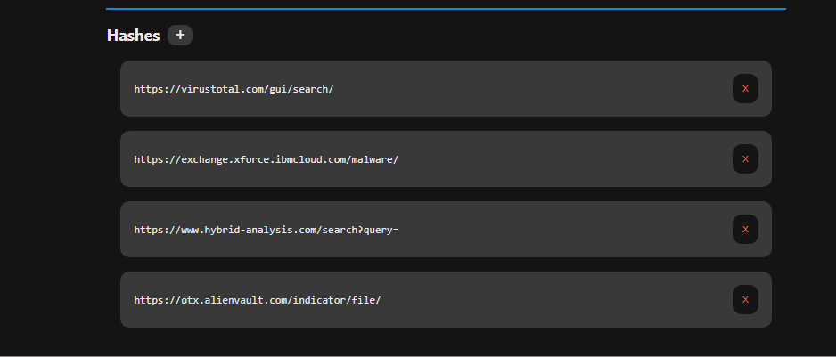

# 

#  
**Osinter**

## 
Customizable OSINT tool for quick artifact lookup

### Available on the [Chrome Web Store](https://chrome.google.com/webstore/detail/osinter/lcpljhidkkhfgkacdnolplaembfpaopk)

#### Chrome extension that enables quick lookup of artifacts. Highlight your artifact, right click, and select `Osinter` to simultaneously search multiple threat feeds. 

#### Heavily inspired by [OSINT=*](https://github.com/AdamMOdell/OSINT-equals-star)

### `Input Custom Threat Feeds`

### `Default Threat Feeds`

